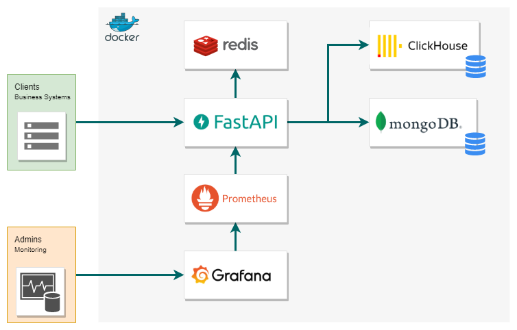
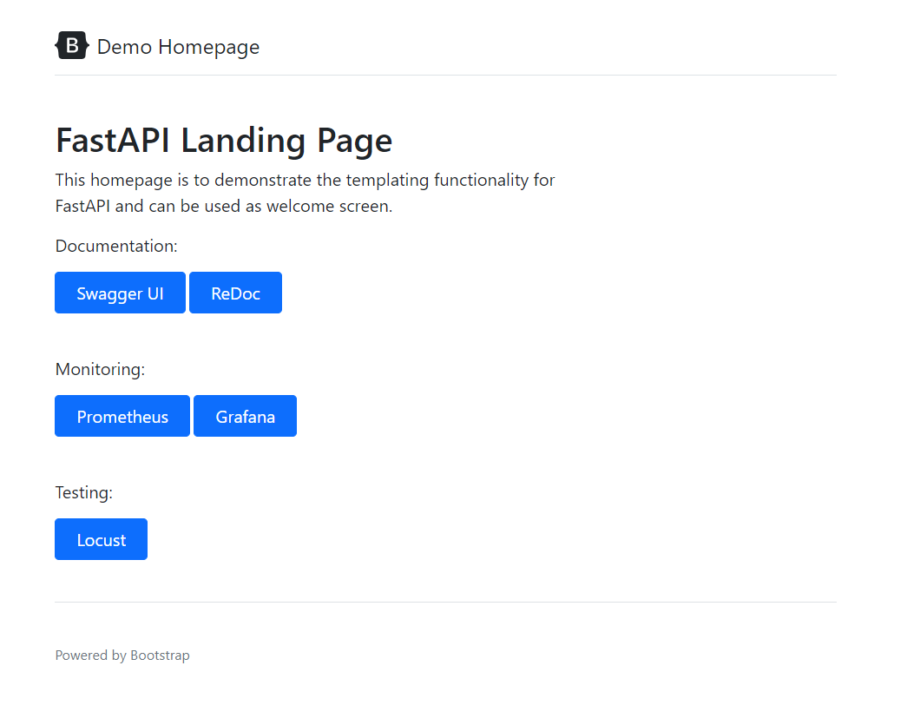
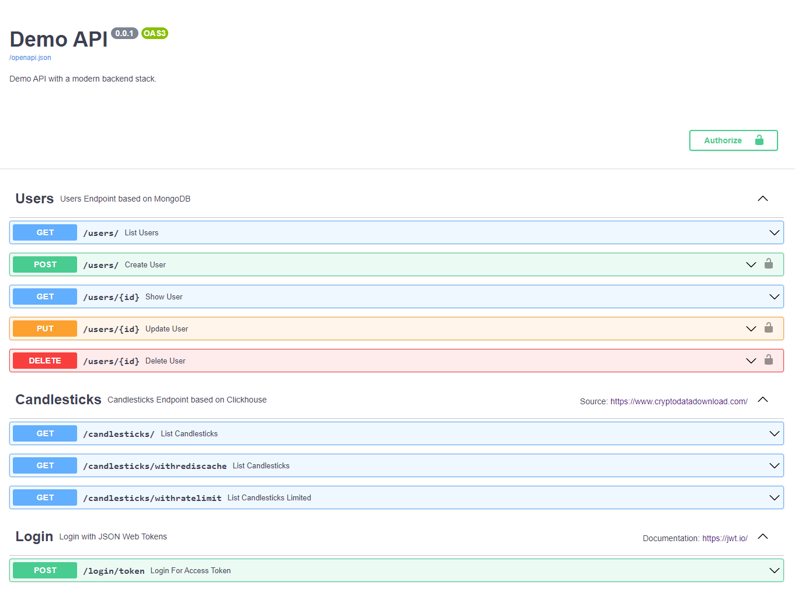
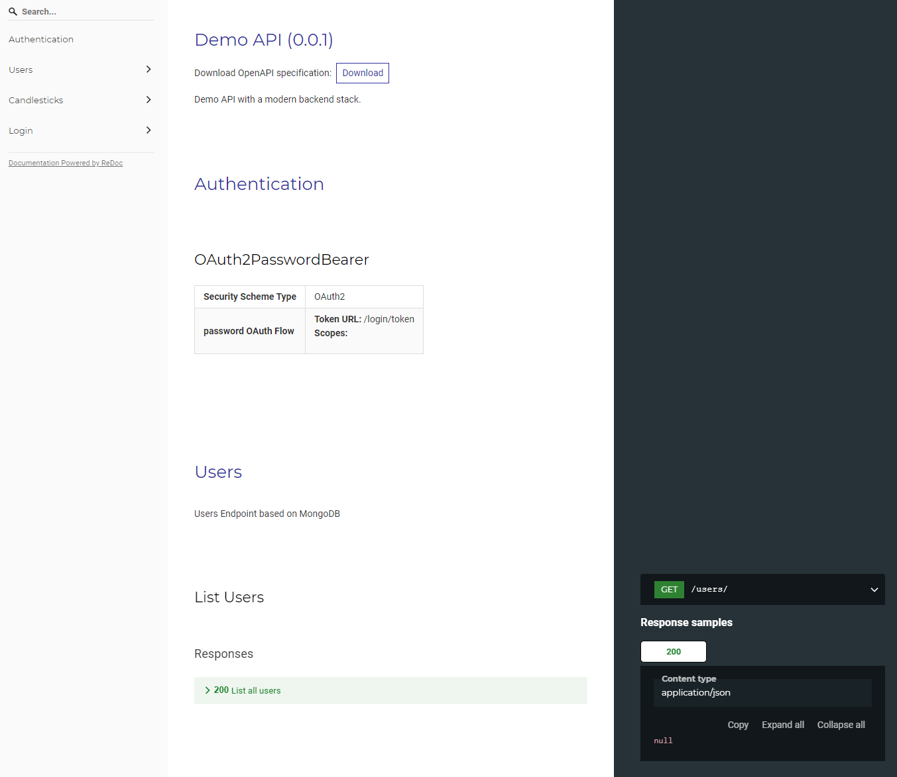
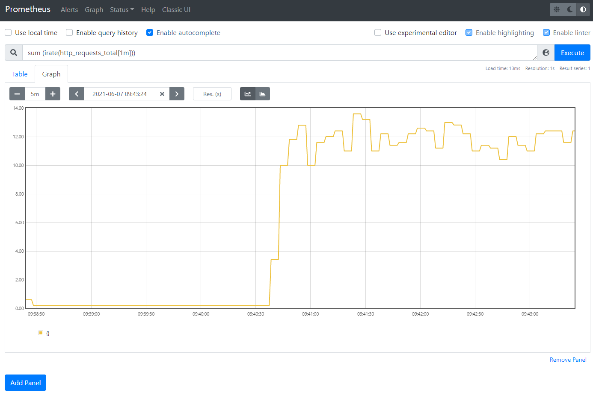
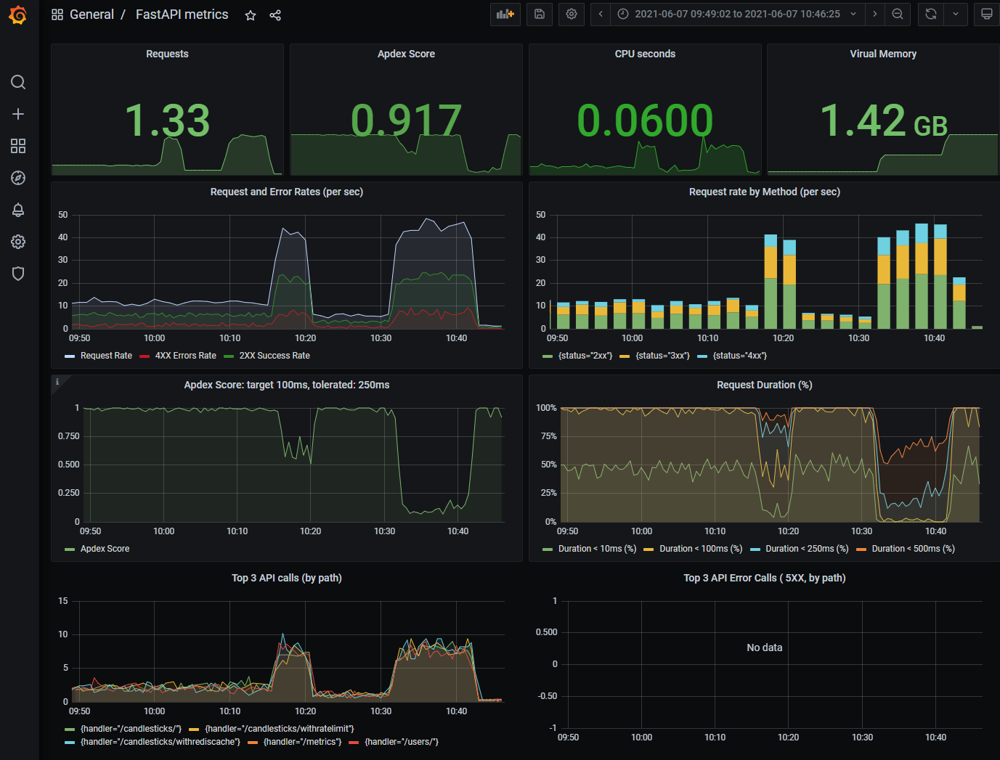
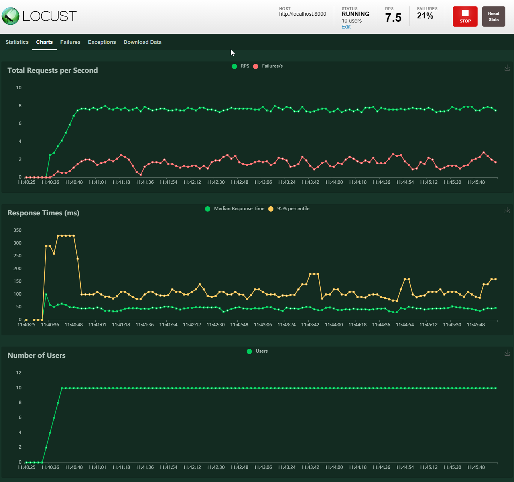
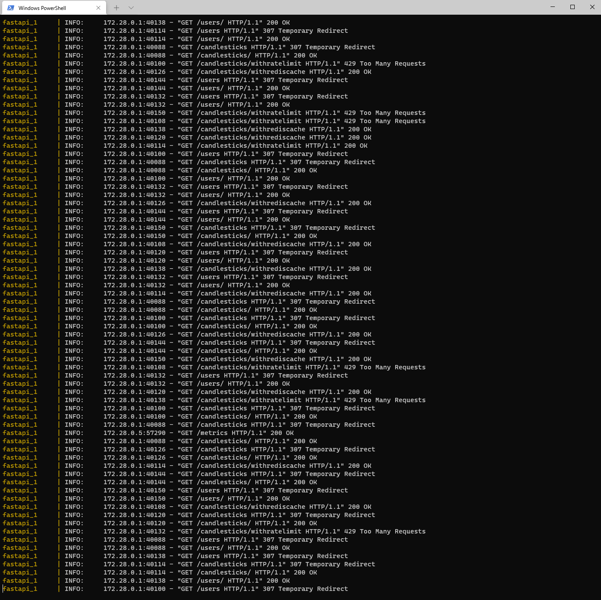

# FastAPI Modern Backend Stack Demo

In this repository I present my solution based on [FastAPI](https://fastapi.tiangolo.com/) and a modern backend stack. Topics covered:

- All the software used in this demo is running in a [docker](https://www.docker.com/) container because of security, replicability and development simplicity
- Two different database types are connected to the API to simulate real world scenarios. Demo data is automatically loaded in the databases:
  - MongoDB: users collection (~1k documents) generated with [Randomuser](https://randomuser.me/). The passwords are additionally hashed using [bcrypt](https://en.wikipedia.org/wiki/Bcrypt)
  - Clickhouse: cryptocurrency candlestick timeseries (1.5M records) downloaded from [Cryptodatadownload](https://www.cryptodatadownload.com/)
- The user data is validated with [pydantic](https://pydantic-docs.helpmanual.io/)
- The API contains the following [HTTP verbs](https://developer.mozilla.org/en-US/docs/Web/HTTP/Methods): GET, POST, PUT and DELETE
- Automatic and interactive API documentation provided by [Swagger UI](https://swagger.io/tools/swagger-ui/) and [Redoc](https://redoc.ly/)
- Authentication with [JSON Web Tokens](https://jwt.io/) (JWT)
- Advanced features like: coroutines with [async and await](https://fastapi.tiangolo.com/async/), [requests limit](https://pypi.org/project/fastapi-limiter/) based on IP, [caching](https://pypi.org/project/fastapi-cache2/) with [Redis](https://redis.io/) and templating with ([Jinja2](https://jinja.palletsprojects.com/en/3.0.x/))
- Unit test with [pytest](https://docs.pytest.org/)
- Performance/load testing with [Locust](https://locust.io/)
- Monitoring with [Prometheus](https://github.com/trallnag/prometheus-fastapi-instrumentator) and [Grafana](https://grafana.com/)
- Some useful [developer tools](developer_tools.md) (Visual Studio Code, Python plugins, Chrome extensions, ...)

## Why FastAPI?

### Pro

- Very high performance (on par with NodeJS and Go)
- Comfortable / easy to learn
- Scalable
- Interactive documentation
- Data validation in deeply nested JSON requests
- Builds on standards like JSON Schema, OAuth 2.0 and OpenAPI
- Secure and production-ready
- GraphQL support

### Contra

- Compared to other frameworks is FastAPI relatively new and the community is not so big
- Limited educational resources

## Architecture



## Screenshots

Some screenshots of the running app:















## Build and start

This app can be run on your local machine. Requirements:

- [Docker](https://www.docker.com/)
- [Python](https://www.python.org/downloads/) (add it also to the PATH variable)
- Python packages (run `python -m pip install -r fastapi/requirements.txt`)

Run the following command in the root path of this project:

```bash
docker-compose up --build
```

Then open the browser at [http://localhost:8000](http://localhost:8000)

## Test

Run unit tests with:

```bash
pytest
```

## Performance

Run this command to test the performance/generate some load:

```bash
locust
```

And open your browser at [http://localhost:8089](http://localhost:8089)

## Next steps

- Splunk integration (for advanced log analysis)
- Docker scan (vulnerability scanning)
- Sonarcube (code quality and security)
- Horizhontal scaling (distribute load across multiple instances)
- CD/CI with Jenkins (build and integration automation)
- Code coverage (measurement of the executed code while testing)
- Kubernetes integration (with dedicated user and read-only file system for improved security)
